<h1>👋 أهلاً، أنا محمد أحمد حلمي عابورة</h1>

 

---

## 🧑‍💻 نبذة عني

- 🌐 مطوّر ويب Full-Stack بابني وأنشر وأصيّن منتجات حقيقية للعملاء
- 🖥️ بعمل تطبيقات سطح مكتب بـ Python و CustomTkinter
- 📚 بكتب محتوى تعليمي وكتب ومراجعات لتبسيط البرمجة
- 📣 بشتغل في التسويق الرقمي وبساعد المشاريع توصل لعملائها وتكبر أونلاين
- 🎬 بصنع محتوى (مكتوب ومرئي) يجذب الجمهور ويبني الثقة في البراند
- 🤝 متاح لمشاريع الـ Freelance — كلمني!

---

## 🛠️ مهاراتي وخبراتي

  

| المجال | التقنيات |
|:------:|:---------|
| 🎨 **Frontend** | HTML • CSS • JavaScript • TypeScript • React |
| 🐍 **Desktop** | Python • CustomTkinter |
| 🔧 **Tools** | Git • GitHub |
| 📣 **Marketing** | Digital Marketing • Social Media • Lead Generation • Branding |
| 🎬 **Content** | Content Creation • Copywriting • Educational Content • Video & Design |

---

## 📊 إحصائيات GitHub

 

 

---

## 📞 تواصل معي

---

### 💬 "الكود الجيد بيتكتب مرة، لكن بيتقرأ ألف مرة."

